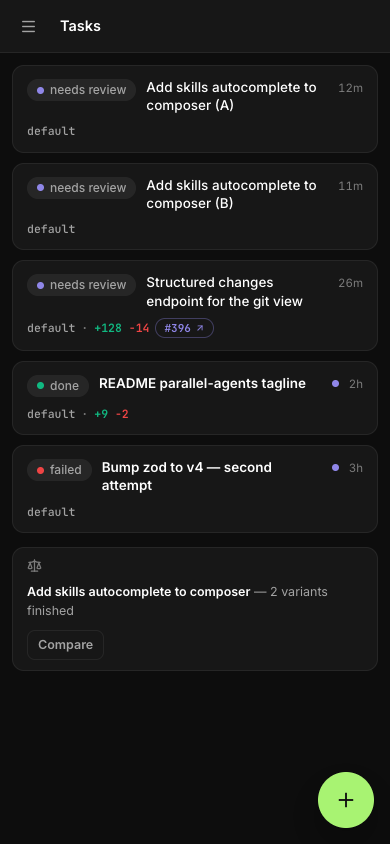
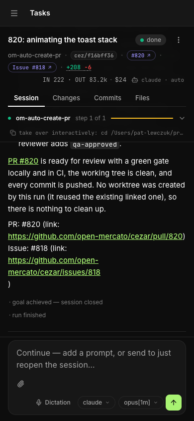

<div align="center">
  <h1>cezar ⚡</h1>
</div>

<h4 align="center">
  <a href="https://www.youtube.com/watch?v=nNLJm9gArnE">Demo</a>&nbsp;·
  <a href="#quick-start">Quick start</a>&nbsp;·
  <a href="docs/reference.md">Docs</a>&nbsp;·
  <a href="https://github.com/open-mercato/cezar/issues">Issues</a>
</h4>

- 👀 **No visibility into a running agent.** A headless `claude` run is a black box
  until it finishes. cezar streams every step — agent text, each tool call and
  its result, tokens and cost per step — live, and keeps the full replay.
- 🧩 **One agent, one working tree, one thing at a time.** Kick off a second task and
  it fights the first over your files. cezar runs each task in its **own git
  worktree**, so two (or three) agents work in parallel without stepping on
  each other — or on the branch you're editing.
- 🗂️ **A backlog that needs babysitting.** Queue a stack of tasks and cezar
  **orchestrates** them: it runs up to your parallel limit and holds the rest in
  an ordered queue. Point it at a GitHub issue and it runs straight on that, so
  working the tracker down stops being a manual chore. Turn on the opt-in
  **Inbox** (`CEZ_FOLLOWUPS=1`) and an agent's leftover follow-ups become the
  next tasks too — one click each.
- 🤖 **"Autonomous" means you still have to sit there.** Flip the **Autonomous**
  flag and a run never parks to ask — it keeps going until the task is done, and it
  always skips the review gate below. Pair it with a **skill** (a Markdown playbook)
  and you've got fire-and-forget automation: hand off "fix this", "upgrade that",
  "triage these" and walk away.
- ✅ **The agent finishes and you have to trust it.** Nothing ever auto-merges — the
  work rests on the task's own branch until you act on it. Switch on the optional
  **review gate** (Settings → Agents, or `CEZ_REVIEW_GATE=1`; off by default) and a
  non-autonomous run with changes parks at `review` instead of finishing: inspect the
  diff, send notes back into the same session, or push a **draft PR**.
- ♻️ **Losing a session when it fails.** Every run records its `claude` session id.
  Take it over interactively in one click (`claude --resume <id>`), or continue it
  in-process from the cockpit.
- 🔀 **Locked into one agent vendor.** Most tools wed you to a single CLI. cezar
  drives **Claude Code, Codex and OpenCode (experimental)** through one runner seam — set a
  default, pick a backend per task, or mix them inside one workflow (implement
  with one agent, review with another) — and through **OpenCode** you can point
  a run at **open-source or local models**, not just the big vendors. See
  [Agent backends](#coding-agent-backends).
- 🖥️ **Close the laptop and the work stops.** A local agent only runs while your
  machine is on and awake. Put cezar on a **VPS, cloud box, or dedicated server**
  and the cockpit becomes the GUI for an **always-on AI coding team** — kick off,
  watch and steer tasks from your laptop or **phone**, on the train or between
  meetings, while the agents keep grinding through the backlog back on the server.
- ⚡ **Setup tax.** No wizard, no env vars, no schema. Skills are Markdown, workflows
  are short YAML, and everything degrades: no `gh` → works without PRs, no network
  → local skills still load, no `.ai/skills` → the bare prompt still runs.

---

<p align="center">
  <a href="LICENSE">
    </a>
  <a href="https://www.npmjs.com/package/@open-mercato/cezar">
    </a>
  
  <a href="https://github.com/open-mercato/cezar/pulls">
    </a>
</p>

<div align="center">
  <a href="https://www.youtube.com/watch?v=nNLJm9gArnE" target="_blank" rel="noopener">
    
  </a>
  <p align="center"><em>▶ Watch the video: Meet cezar, your new parallel coding tool.</em></p>
</div>

## Features

- 💯&nbsp;Free and open source.
- 🖥️&nbsp;Uses your own `claude`, `codex`, `opencode` or `pi` login. No API key needed.
- ☁️&nbsp;Easy to set up on a VPS, so your agents keep working when your laptop is closed.
- 📱&nbsp;Fully responsive. Start and review tasks from your phone.
- 🔀&nbsp;Every task gets its own git worktree, so several agents can work at the same time. Extra tasks wait in a queue.
- 🤖&nbsp;Turn on **Autonomous** and a run never stops to ask. It just finishes.
- 📡&nbsp;Watch it work live: agent text, tool calls, tokens and cost.
- 🏁&nbsp;Run the same task ×2 or ×3, compare the diffs and keep the best one.
- 🧩&nbsp;Skills are Markdown files and workflows are short YAML files. Mix agents per step.
- 🐙&nbsp;Run the agent straight on a GitHub issue. Nothing merges on its own.
- 📂&nbsp;One cockpit for all your projects.
- 💾&nbsp;No database. Everything is saved as plain files in `.ai/cezar/`.

## Screenshots

**Parallel tasks** — Run and queue many tasks, each in its own git worktree.

[](docs/screenshots/task-view.png)

**Live run** — Every step, tool call and token, as it happens.

[](docs/screenshots/live-run.png)

**Variants** — Run a task ×2 or ×3 and keep the best diff.

[](docs/screenshots/variants-compare.png)

**Workflows** — Drag skills and checks into a chain, saved as YAML.

[](docs/screenshots/workflow-builder.png)

**GitHub** — Hand an open issue to the agent in one click.

[](docs/screenshots/github-issues.png)

**Skills + Autonomous** — Pick a playbook, flip Autonomous and walk away.

[](docs/screenshots/skills-autonomous.png)

**On your phone** — the same cockpit, from the task list to the diff.

<table>
  <tr>
    <td width="33%"></td>
    <td width="33%"></td>
    <td width="33%"></td>
  </tr>
</table>

## Quick start

You need **Node 20+** and at least one agent CLI you're logged into:
[Claude Code](https://github.com/anthropics/claude-code), [Codex](https://github.com/openai/codex),
[OpenCode](https://opencode.ai) or [pi](https://github.com/badlogic/pi-mono).
`git` and `gh` are optional.

```bash
cd your-repo
npx cezar-cli
```

This opens the cockpit at `http://localhost:4321`. Type a task, pick a workflow, then hit **Start**.

```bash
npx cezar-cli run "add a --json flag to the export command"   # headless, no browser
npx cezar-cli init                                            # scaffold .ai/cezar/
npx cezar-cli@nightly                                         # try tonight's build
```

> Just want to look around? Run `CEZ_DRY_RUN=1 npx cezar-cli`. It uses a built-in mock agent, so you don't need to log in.

### Run it on a server

```bash
npx cezar-cli server-install --platform ubuntu-vps
```

This sets up HTTPS, a login and a system service, so you can open the cockpit from anywhere, including your phone.
There are guides for [Ubuntu VPS](docs/server-install/ubuntu-vps.md) and [macOS + ngrok](docs/server-install/macosx-ngrok.md).

## How it works

1. **You describe a task.** Type it, attach files, or start from a GitHub issue.
2. **cezar runs a workflow** (agent steps plus shell checks) in a new git worktree, using your agent CLI.
3. **The cockpit streams every step live.** If a check fails, the agent tries again and sees the error.
4. **You check the result.** Read the diff, send notes back, or open a draft PR.

A workflow is a small YAML file in `.ai/cezar/workflows/`:

```yaml
name: fix-and-verify
steps:
  - id: implement
    prompt: "{{task}}"
    skill: project-conventions   # optional: a Markdown skill from .ai/skills
    runner: codex                # optional: which agent runs this step
  - id: verify
    command: "npm test"          # exit 0 = pass
    onFail: { retry: implement, max: 2 }
```

The built-in `quick-task` workflow runs with no setup.

## Documentation

The [reference](docs/reference.md) covers everything else:
[configuration](docs/reference.md#configuration-optional),
[environment variables](docs/reference.md#how-it-runs-agents),
[agent backends](docs/reference.md#coding-agent-backends),
[multiple projects](docs/reference.md#multiple-projects-one-cockpit),
[remote access](docs/reference.md#remote-access-host-cezar-on-a-server) and
[local development](docs/reference.md#local-development).

## Contributing

- Found a bug or missing something? [Open an issue](https://github.com/open-mercato/cezar/issues).
- Want to contribute? PRs are welcome. See [local development](docs/reference.md#local-development) to get started:

```bash
git clone https://github.com/open-mercato/cezar.git && cd cezar
npm install
npm run dev
```

## License

**MIT** © Patryk Lewczuk. Full text in [LICENSE](LICENSE).
